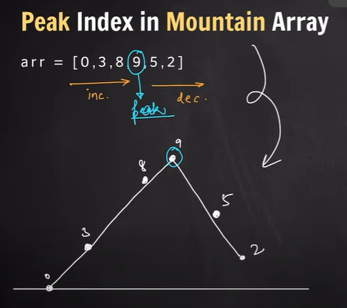

# **Topic**
## **Problem Solving**

- **`Peak Index in Mountain Array`** : An array is give in increasing order and then it decreases after a peak value. Find the index of the peak element.
---

- **`Single Element In Sorted array`** : Given a sorted array with contains duplicate elements in pair and 1 single element, Find it.